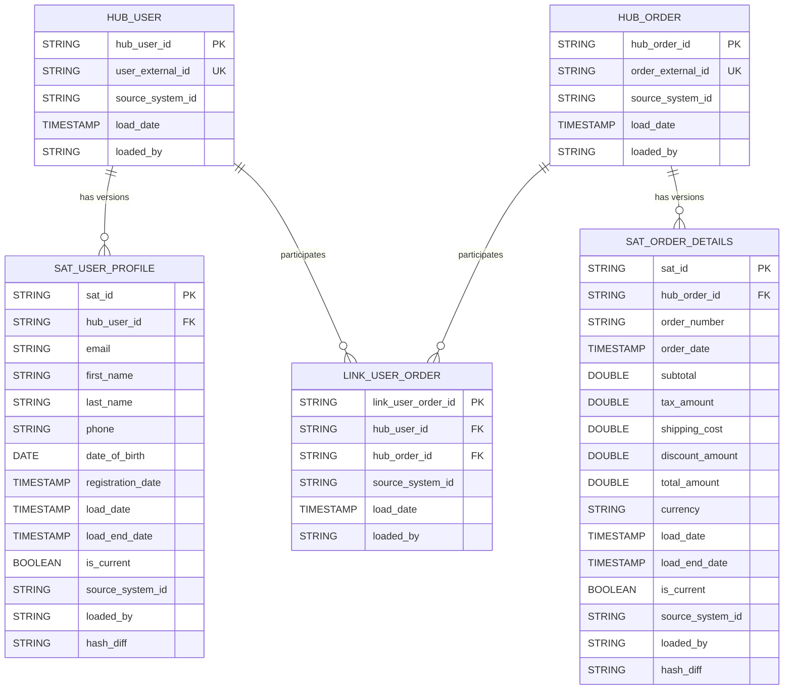
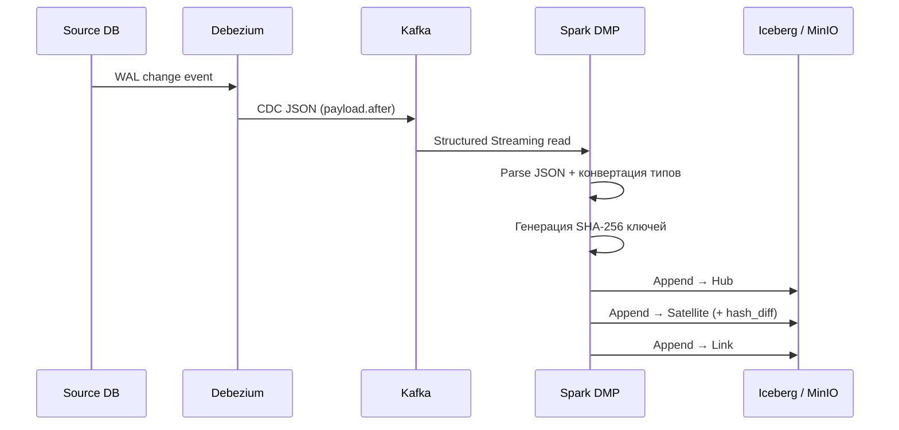

# ДЗ-2: Data Warehouse

## Архитектура DWH

### Выбор: Data Vault 2.0

Мы выбрали **Data Vault 2.0**, потому что источники представлены несколькими микросервисами, изменения поступают инкрементально через CDC (Debezium → Kafka), и требуется детальный слой с минимальным использованием update/delete и явной прослеживаемостью до источника.

## Анализ предметной области

### Системы-источники

Предметная область представлена тремя микросервисами, каждый со своей PostgreSQL HA базой (Patroni + Etcd + HAProxy):

| Источник | Порт | Debezium topic prefix | Основные таблицы |
|---|---|---|---|
| **User Service** | 5432 | `debezium-user-service` | `users` |
| **Order Service** | 5433 | `debezium-order-service` | `orders` |
| **Logistics Service** | 5434 | `debezium-logistics-service` | `warehouses`, `shipments` |

### Сущности и атрибуты

#### User (User Service)

Пользователь системы — центральная сущность, к которой привязаны заказы.

| Атрибут | Тип | Описание |
|---|---|---|
| `user_external_id` | UUID | **Бизнес-ключ** — внешний идентификатор |
| `email` | VARCHAR | Email пользователя |
| `first_name` | VARCHAR | Имя |
| `last_name` | VARCHAR | Фамилия |
| `phone` | VARCHAR | Телефон |
| `date_of_birth` | DATE | Дата рождения |
| `registration_date` | TIMESTAMP | Дата регистрации |
| `status` | VARCHAR | Статус (`active`, `inactive`, …) |

#### Order (Order Service)

Заказ — основная бизнес-операция, связывающая пользователя с покупкой.

| Атрибут | Тип | Описание |
|---|---|---|
| `order_external_id` | UUID | **Бизнес-ключ** — внешний идентификатор заказа |
| `user_external_id` | UUID | Ссылка на пользователя (FK → User) |
| `order_number` | VARCHAR | Человекочитаемый номер заказа |
| `order_date` | TIMESTAMP | Дата создания заказа |
| `status` | VARCHAR | Статус (`pending`, `processing`, `completed`, …) |
| `subtotal` | NUMERIC | Сумма до налогов/скидок |
| `tax_amount` | NUMERIC | Налог |
| `shipping_cost` | NUMERIC | Стоимость доставки |
| `discount_amount` | NUMERIC | Скидка |
| `total_amount` | NUMERIC | Итоговая сумма |
| `currency` | VARCHAR | Валюта (`USD`, …) |
| `payment_method` | VARCHAR | Способ оплаты |
| `payment_status` | VARCHAR | Статус оплаты |

#### Warehouse (Logistics Service)

Склад — точка хранения и отгрузки товаров.

| Атрибут | Тип | Описание |
|---|---|---|
| `warehouse_code` | VARCHAR | **Бизнес-ключ** — код склада |
| `warehouse_name` | VARCHAR | Название |
| `warehouse_type` | VARCHAR | Тип (`distribution`, `regional`, …) |
| `country`, `city`, `street_address`, `postal_code` | VARCHAR | Адрес |
| `contact_phone` | VARCHAR | Телефон |
| `manager_name` | VARCHAR | Имя менеджера |

#### Shipment (Logistics Service)

Отправление — доставка заказа со склада.

| Атрибут | Тип | Описание |
|---|---|---|
| `shipment_external_id` | UUID | **Бизнес-ключ** — внешний идентификатор |
| `order_external_id` | UUID | Ссылка на заказ (FK → Order) |
| `tracking_number` | VARCHAR | Трекинг-номер |
| `status` | VARCHAR | Статус доставки |
| `origin_warehouse_code` | VARCHAR | Склад отправки (FK → Warehouse) |
| `estimated_delivery_date` | TIMESTAMP | Ожидаемая дата доставки |

### Связи между сущностями

```
User ──1:N──> Order ──1:N──> Shipment ──N:1──> Warehouse
```

- **User → Order**: один пользователь может иметь много заказов (через `user_external_id`)
- **Order → Shipment**: один заказ может иметь несколько отправлений
- **Shipment → Warehouse**: отправление отгружается с одного склада

### Маппинг на Data Vault 2.0

| Источник | DV2.0 структура | Описание |
|---|---|---|
| `user_external_id` | **Hub** `hub_user` | Бизнес-ключ пользователя |
| `order_external_id` | **Hub** `hub_order` | Бизнес-ключ заказа |
| User → Order (через `user_external_id` в orders) | **Link** `link_user_order` | Связь пользователь-заказ |
| email, имя, телефон, дата рождения, регистрация | **Satellite** `sat_user_profile` | Профиль пользователя (SCD2) |
| номер заказа, дата, суммы, валюта | **Satellite** `sat_order_details` | Детали заказа (SCD2) |

## Детальный слой DWH (DDL)

Все таблицы создаются в схеме `iceberg.dwh_detailed` в формате Apache Iceberg (Parquet + Snappy). Суррогатные ключи — SHA-256 хеши от бизнес-ключей (тип `STRING`, 64-символьная hex-строка). Использование STRING вместо целочисленного типа обусловлено тем, что `sha2()` в Spark возвращает hex-строку, которая не помещается в BIGINT.

### Hubs

```sql
-- Бизнес-ключи пользователей
CREATE TABLE IF NOT EXISTS iceberg.dwh_detailed.hub_user (
    hub_user_id      STRING,      -- SHA-256(user_external_id)
    user_external_id STRING,      -- бизнес-ключ
    source_system_id STRING,      -- 'user-service'
    load_date        TIMESTAMP,
    loaded_by        STRING       -- 'dmp-spark'
) USING iceberg;

-- Бизнес-ключи заказов
CREATE TABLE IF NOT EXISTS iceberg.dwh_detailed.hub_order (
    hub_order_id      STRING,     -- SHA-256(order_external_id)
    order_external_id STRING,     -- бизнес-ключ
    source_system_id  STRING,     -- 'order-service'
    load_date         TIMESTAMP,
    loaded_by         STRING
) USING iceberg;
```

### Links

```sql
-- Связь пользователь → заказ
CREATE TABLE IF NOT EXISTS iceberg.dwh_detailed.link_user_order (
    link_user_order_id STRING,    -- SHA-256(user_external_id || order_external_id)
    hub_user_id        STRING,    -- FK → hub_user
    hub_order_id       STRING,    -- FK → hub_order
    source_system_id   STRING,
    load_date          TIMESTAMP,
    loaded_by          STRING
) USING iceberg;
```

### Satellites

```sql
-- Профиль пользователя (SCD Type 2)
CREATE TABLE IF NOT EXISTS iceberg.dwh_detailed.sat_user_profile (
    sat_id            STRING,     -- SHA-256(user_external_id || timestamp)
    hub_user_id       STRING,     -- FK → hub_user
    email             STRING,
    first_name        STRING,
    last_name         STRING,
    phone             STRING,
    date_of_birth     DATE,
    registration_date TIMESTAMP,
    load_date         TIMESTAMP,  -- начало действия версии
    load_end_date     TIMESTAMP,  -- конец действия (NULL = актуальная)
    is_current        BOOLEAN,    -- признак текущей версии
    source_system_id  STRING,
    loaded_by         STRING,
    hash_diff         STRING      -- SHA-256 от бизнес-атрибутов
) USING iceberg;

-- Детали заказа (SCD Type 2)
CREATE TABLE IF NOT EXISTS iceberg.dwh_detailed.sat_order_details (
    sat_id            STRING,
    hub_order_id      STRING,     -- FK → hub_order
    order_number      STRING,
    order_date        TIMESTAMP,
    subtotal          DOUBLE,
    tax_amount        DOUBLE,
    shipping_cost     DOUBLE,
    discount_amount   DOUBLE,
    total_amount      DOUBLE,
    currency          STRING,
    load_date         TIMESTAMP,
    load_end_date     TIMESTAMP,
    is_current        BOOLEAN,
    source_system_id  STRING,
    loaded_by         STRING,
    hash_diff         STRING
) USING iceberg;
```

### Конвенции нейминга

| Тип | Префикс | Суррогатный ключ | Пример |
|---|---|---|---|
| Hub | `hub_` | `hub_<entity>_id` — SHA-256 от бизнес-ключа | `hub_user`, `hub_order` |
| Link | `link_` | `link_<name>_id` — SHA-256 от комбинации ключей | `link_user_order` |
| Satellite | `sat_` | `sat_id` — SHA-256 от бизнес-ключа + timestamp | `sat_user_profile`, `sat_order_details` |

### Технические поля

Каждая таблица содержит:

| Поле | Тип | Описание |
|---|---|---|
| `source_system_id` | STRING | Идентификатор источника (`user-service`, `order-service`) |
| `load_date` | TIMESTAMP | Время загрузки записи |
| `loaded_by` | STRING | Процесс загрузки (`dmp-spark`) |

Дополнительно в Satellites:

| Поле | Тип | Описание |
|---|---|---|
| `load_end_date` | TIMESTAMP | Время закрытия версии (NULL = актуальная) |
| `is_current` | BOOLEAN | Признак текущей версии |
| `hash_diff` | STRING | SHA-256 от бизнес-атрибутов для детекции изменений |

## ER-диаграмма



## DMP процесс

### Общая архитектура

```
PostgreSQL HA (Patroni) → Debezium CDC → Kafka → Spark Structured Streaming → Iceberg (MinIO)
```

DMP реализован как Spark Structured Streaming приложение (`dwh-spark/scripts/dmp_main.py`), которое непрерывно читает CDC-события из Kafka и раскладывает их по структурам Data Vault.

### Потоковая обработка

При старте DMP:

1. **Инициализация схемы** — создаёт базу данных `dwh_detailed` и все 5 таблиц (2 Hub, 2 Satellite, 1 Link) через `CREATE TABLE IF NOT EXISTS`
2. **Запуск стриминга** — параллельно запускаются 5 streaming queries:
   - **User events** (топик `debezium-user-service.public.users`):
     - Парсинг Debezium JSON через `get_json_object(value, "$.payload.after.*")`
     - → `hub_user` (SHA-256 от `user_external_id`)
     - → `sat_user_profile` (email, имя, телефон, дата рождения, регистрация + hash_diff)
   - **Order events** (топик `debezium-order-service.public.orders`):
     - → `hub_order` (SHA-256 от `order_external_id`)
     - → `sat_order_details` (номер, дата, суммы, валюта + hash_diff)
     - → `link_user_order` (SHA-256 от `user_external_id` + `order_external_id`)

### Обработка типов Debezium

| Тип в PostgreSQL | Формат Debezium | Конвертация в Spark |
|---|---|---|
| `DATE` | int (дни от epoch) | `date_add(to_date('1970-01-01'), days)` |
| `TIMESTAMP` | long (микросекунды) | `timestamp_micros(value)` |
| `NUMERIC` | double (`decimal.handling.mode=double`) | прямое чтение |
| `UUID` / `VARCHAR` | string | прямое чтение |

### Data Flow



## MPP/S3 вместо PostgreSQL

Вместо отдельного PostgreSQL для DWH используется связка **MinIO + Apache Iceberg + Apache Spark**:

| Компонент | Роль | Аналог в классическом DWH |
|---|---|---|
| **MinIO** | S3-совместимое объектное хранилище | Дисковая подсистема СУБД |
| **Apache Iceberg** | Табличный формат (ACID, schema evolution, time travel) | Storage engine |
| **Hive Metastore** | Каталог таблиц (через PostgreSQL для метаданных) | Системный каталог |
| **Apache Spark** | Движок обработки (MPP) | Query engine |

### Обоснование выбора

- **Разделение storage и compute** — MinIO и Spark масштабируются независимо
- **Iceberg ACID** — атомарные транзакции, schema evolution, time travel, partition evolution
- **Parquet + Snappy** — колоночное хранение с компрессией, эффективно для аналитики
- **Spark Structured Streaming** — нативная интеграция с Kafka для real-time загрузки
- **Открытые стандарты** — нет vendor lock-in

### Инфраструктура DWH (`docker-compose-dwh.yaml`)

| Сервис | Образ | Назначение |
|---|---|---|
| `minio` | `minio/minio` | S3-хранилище данных |
| `metastore-db` | `postgres:16-alpine` | PostgreSQL для метаданных Hive |
| `hive-metastore` | custom build | Каталог Iceberg таблиц |
| `spark-master` | `spark-with-iceberg:4.0.1` | Координатор кластера |
| `spark-worker` | `spark-with-iceberg:4.0.1` | Исполнитель задач |
| `dwh-dmp` | `spark-with-iceberg:4.0.1` | DMP streaming приложение |

## Запуск

### 1. Поднять источники + Kafka + Debezium

```bash
docker-compose up -d
```

### 2. Поднять DWH инфраструктуру

```bash
docker-compose -f docker-compose-dwh.yaml up -d
```

### 3. Вставить тестовые данные

```bash
./scripts/insert_mock_data.sh
```

### 4. Проверить данные в DWH

```bash
docker exec dwh-spark-master /opt/spark/bin/spark-submit \
  --master 'local[*]' \
  /opt/scripts/query_examples.py
```

### Остановка

```bash
docker-compose -f docker-compose-dwh.yaml down
docker-compose down
```

## Проверка работоспособности

### SQL-запрос: пользователи с заказами

```sql
SELECT
    hu.user_external_id,
    sup.first_name,
    sup.last_name,
    sup.email,
    ho.order_external_id,
    sod.order_number,
    sod.order_date,
    sod.total_amount,
    sod.currency
FROM iceberg.dwh_detailed.link_user_order luo
JOIN iceberg.dwh_detailed.hub_user hu ON luo.hub_user_id = hu.hub_user_id
JOIN iceberg.dwh_detailed.hub_order ho ON luo.hub_order_id = ho.hub_order_id
LEFT JOIN iceberg.dwh_detailed.sat_user_profile sup
    ON hu.hub_user_id = sup.hub_user_id AND sup.is_current = true
LEFT JOIN iceberg.dwh_detailed.sat_order_details sod
    ON ho.hub_order_id = sod.hub_order_id AND sod.is_current = true;
```

### Web UI

| Сервис | URL | Описание |
|---|---|---|
| MinIO Console | http://localhost:9001 | S3-хранилище (minioadmin/minioadmin) |
| Spark Master | http://localhost:8080 | Spark кластер |
| Spark Worker | http://localhost:8081 | Worker node |

