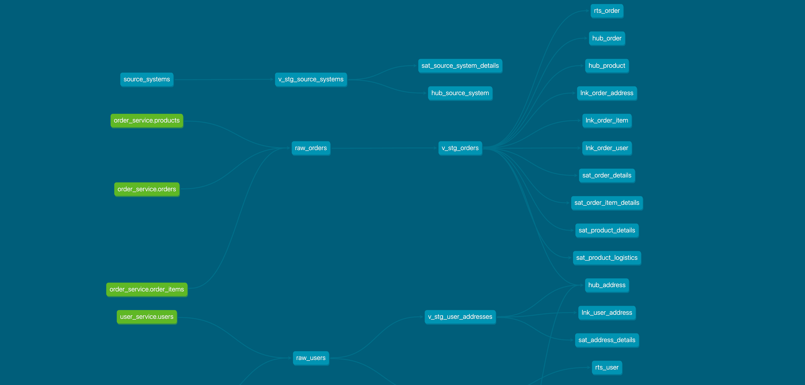
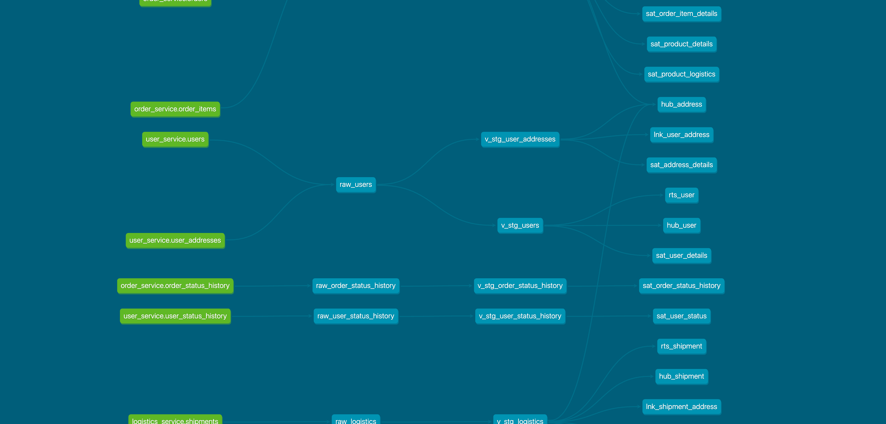
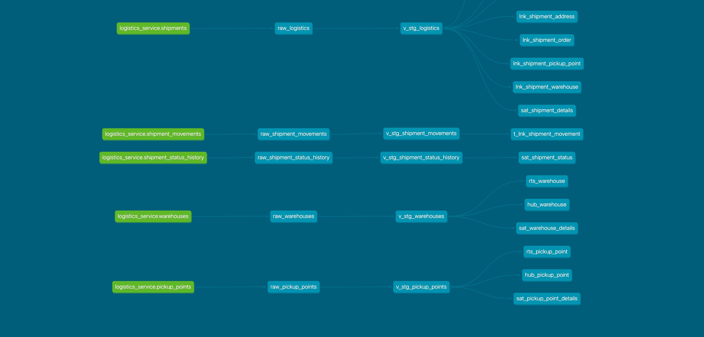

# ДЗ-2: Data Warehouse

## Быстрый старт

1. Создать сети docker:

```bash
./scripts/create-networks.sh
```

2. Поднять DWH инфраструктуру:

```bash
docker-compose -f docker-compose-dwh.yaml up
```

3. Поднять все остальное (OLTP, Kafka, Debezium):

```bash
docker-compose -f docker-compose.yaml up
```

4. Вставить [тестовые данные](https://clck.ru/3QCYgU):

```bash
./scripts/load_all_csv.sh ~/path/to/mock_data
```

При выполнении скрипта загружается одновременно достаточно большой объём данных (у нас это занимало ~1-1.5 минуты), наблюдали в админке minio и логах коннектора, как данные поступают в Iceberg-таблицы.

5. Построить детальный слой DWH:

```bash
./dbt.sh build --profiles-dir .
```

6*. Spark SQL для проверки:

```sql
./scripts/spark-sql.sh
```

7. Остановить:

```bash
docker-compose -f docker-compose-dwh.yaml down
docker-compose down
```

## Инфраструктура DWH

Используется стек **MinIO (S3 API) + Apache Iceberg + Apache Spark**.

## [dbt проект](dbt/)

dbt-проект `marketplace` строит детальный слой DWH по методологии **Data Vault 2.0** с помощью макросов [AutomateDV](https://automate-dv.readthedocs.io/en/latest/) 0.11.5. Стек: **dbt-spark 1.10** → **Apache Spark 4.0** → **Apache Iceberg**.

### Слои моделей

| Слой        | Материализация | Описание                                                                               |
| ----------- | -------------- | -------------------------------------------------------------------------------------- |
| `raw_stage` | view           | Прямое чтение Iceberg-таблиц, созданных Kafka Connect из CDC-топиков                   |
| `stage`     | view           | Хеширование ключей (SHA-256), маппинг атрибутов, фильтрация дублей и удалённых записей |
| `raw_vault` | incremental    | Hubs, Links, Satellites, T-Links, Record Tracking Satellites                           |

### Источники данных (CDC → Iceberg)

Три микросервиса доставляют данные через **Debezium → Kafka → Iceberg Sink Connector**:

- **order_service** — `orders`, `order_items`, `order_status_history`, `products`
- **user_service** — `users`, `user_addresses`, `user_status_history`
- **logistics_service** — `shipments`, `shipment_movements`, `shipment_status_history`, `warehouses`, `pickup_points`

### Адаптация AutomateDV под Spark

AutomateDV не имеет нативной поддержки Spark — только Snowflake, Databricks и Postgres. Для работы на Spark SQL созданы оверрайды через механизм `dispatch` (приоритет: `marketplace` → `automate_dv`):

Макросы расположены по структуре, аналогичной AutomateDV (`macros/tables/spark/`, `macros/supporting/`, `macros/internal/`), чтобы упростить сравнение с оригиналом.

### Запуск

```bash
./dbt.sh build --profiles-dir .
```

## Архитектура DWH

### Выбор: Data Vault 2.0

Мы выбрали **Data Vault 2.0**, потому что источники представлены несколькими микросервисами, изменения поступают инкрементально через CDC (Debezium → Kafka), и требуется детальный слой с минимальным использованием update/delete и явной прослеживаемостью до источника.

## Анализ предметной области

### Системы-источники

Предметная область представлена тремя микросервисами, каждый со своей PostgreSQL HA базой (Patroni + Etcd + HAProxy):

| Источник              | Порт | Debezium topic prefix        | Основные таблицы          |
| --------------------- | ---- | ---------------------------- | ------------------------- |
| **User Service**      | 5432 | `debezium-user-service`      | `users`                   |
| **Order Service**     | 5433 | `debezium-order-service`     | `orders`                  |
| **Logistics Service** | 5434 | `debezium-logistics-service` | `warehouses`, `shipments` |

### Сущности и атрибуты

#### User (User Service)

Пользователь системы — центральная сущность, к которой привязаны заказы.

| Атрибут             | Тип       | Описание                                |
| ------------------- | --------- | --------------------------------------- |
| `user_external_id`  | UUID      | **Бизнес-ключ** — внешний идентификатор |
| `email`             | VARCHAR   | Email пользователя                      |
| `first_name`        | VARCHAR   | Имя                                     |
| `last_name`         | VARCHAR   | Фамилия                                 |
| `phone`             | VARCHAR   | Телефон                                 |
| `date_of_birth`     | DATE      | Дата рождения                           |
| `registration_date` | TIMESTAMP | Дата регистрации                        |
| `status`            | VARCHAR   | Статус (`active`, `inactive`, …)        |

#### Order (Order Service)

Заказ — основная бизнес-операция, связывающая пользователя с покупкой.

| Атрибут             | Тип       | Описание                                         |
| ------------------- | --------- | ------------------------------------------------ |
| `order_external_id` | UUID      | **Бизнес-ключ** — внешний идентификатор заказа   |
| `user_external_id`  | UUID      | Ссылка на пользователя (FK → User)               |
| `order_number`      | VARCHAR   | Человекочитаемый номер заказа                    |
| `order_date`        | TIMESTAMP | Дата создания заказа                             |
| `status`            | VARCHAR   | Статус (`pending`, `processing`, `completed`, …) |
| `subtotal`          | NUMERIC   | Сумма до налогов/скидок                          |
| `tax_amount`        | NUMERIC   | Налог                                            |
| `shipping_cost`     | NUMERIC   | Стоимость доставки                               |
| `discount_amount`   | NUMERIC   | Скидка                                           |
| `total_amount`      | NUMERIC   | Итоговая сумма                                   |
| `currency`          | VARCHAR   | Валюта (`USD`, …)                                |
| `payment_method`    | VARCHAR   | Способ оплаты                                    |
| `payment_status`    | VARCHAR   | Статус оплаты                                    |

#### Warehouse (Logistics Service)

Склад — точка хранения и отгрузки товаров.

| Атрибут                                            | Тип     | Описание                            |
| -------------------------------------------------- | ------- | ----------------------------------- |
| `warehouse_code`                                   | VARCHAR | **Бизнес-ключ** — код склада        |
| `warehouse_name`                                   | VARCHAR | Название                            |
| `warehouse_type`                                   | VARCHAR | Тип (`distribution`, `regional`, …) |
| `country`, `city`, `street_address`, `postal_code` | VARCHAR | Адрес                               |
| `contact_phone`                                    | VARCHAR | Телефон                             |
| `manager_name`                                     | VARCHAR | Имя менеджера                       |

#### Shipment (Logistics Service)

Отправление — доставка заказа со склада.

| Атрибут                   | Тип       | Описание                                |
| ------------------------- | --------- | --------------------------------------- |
| `shipment_external_id`    | UUID      | **Бизнес-ключ** — внешний идентификатор |
| `order_external_id`       | UUID      | Ссылка на заказ (FK → Order)            |
| `tracking_number`         | VARCHAR   | Трекинг-номер                           |
| `status`                  | VARCHAR   | Статус доставки                         |
| `origin_warehouse_code`   | VARCHAR   | Склад отправки (FK → Warehouse)         |
| `estimated_delivery_date` | TIMESTAMP | Ожидаемая дата доставки                 |

### Связи между сущностями

```
User ──1:N──> Order ──1:N──> Shipment ──N:1──> Warehouse
```

- **User → Order**: один пользователь может иметь много заказов (через `user_external_id`)
- **Order → Shipment**: один заказ может иметь несколько отправлений
- **Shipment → Warehouse**: отправление отгружается с одного склада

### Маппинг на Data Vault 2.0

| Источник                                         | DV2.0 структура                   | Описание                    |
| ------------------------------------------------ | --------------------------------- | --------------------------- |
| `user_external_id`                               | **Hub** `hub_user`                | Бизнес-ключ пользователя    |
| `order_external_id`                              | **Hub** `hub_order`               | Бизнес-ключ заказа          |
| User → Order (через `user_external_id` в orders) | **Link** `lnk_order_user`         | Связь пользователь-заказ    |
| email, имя, телефон, дата рождения, регистрация  | **Satellite** `sat_user_details`  | Детали профиля пользователя |
| ORDER_STATUS, суммы, валюта, метод оплаты        | **Satellite** `sat_order_details` | Детали заказа               |

## Детальный слой DWH (DDL)

Все таблицы создаются в схеме `iceberg.default` в формате Apache Iceberg (Parquet + Snappy). Суррогатные ключи — SHA-256 хеши от бизнес-ключей (тип `STRING`, 64-символьная hex-строка). Использование STRING вместо целочисленного типа обусловлено тем, что `sha2()` в Spark возвращает hex-строку, которая не помещается в BIGINT.

### Hubs

```sql
-- Бизнес-ключи пользователей
CREATE TABLE IF NOT EXISTS iceberg.default.hub_user (
    USER_HK          STRING,      -- SHA-256(USER_EXTERNAL_ID), PK
    USER_EXTERNAL_ID STRING,      -- бизнес-ключ
    LOAD_DATE        TIMESTAMP,
    RECORD_SOURCE    STRING        -- 'USER_SERVICE'
) USING iceberg;

-- Бизнес-ключи заказов
CREATE TABLE IF NOT EXISTS iceberg.default.hub_order (
    ORDER_HK          STRING,     -- SHA-256(ORDER_EXTERNAL_ID), PK
    ORDER_EXTERNAL_ID STRING,     -- бизнес-ключ
    LOAD_DATE         TIMESTAMP,
    RECORD_SOURCE     STRING       -- 'ORDER_SERVICE'
) USING iceberg;
```

### Links

```sql
-- Связь пользователь → заказ
CREATE TABLE IF NOT EXISTS iceberg.default.lnk_order_user (
    LNK_ORDER_USER_HK STRING,     -- SHA-256(ORDER_HK || USER_HK), PK
    ORDER_HK          STRING,     -- FK → hub_order
    USER_HK           STRING,     -- FK → hub_user
    LOAD_DATE         TIMESTAMP,
    RECORD_SOURCE     STRING
) USING iceberg;
```

### Satellites

```sql
-- Детали пользователя
CREATE TABLE IF NOT EXISTS iceberg.default.sat_user_details (
    USER_HK           STRING,     -- FK → hub_user
    LOAD_DATE         TIMESTAMP,
    RECORD_SOURCE     STRING,
    HASHDIFF          STRING,     -- SHA-256 от бизнес-атрибутов
    EFFECTIVE_FROM    TIMESTAMP,
    FIRST_NAME        STRING,
    LAST_NAME         STRING,
    EMAIL             STRING,
    PHONE             STRING,
    DATE_OF_BIRTH     DATE,
    REGISTRATION_DATE DATE
) USING iceberg;

-- Детали заказа
CREATE TABLE IF NOT EXISTS iceberg.default.sat_order_details (
    ORDER_HK               STRING,  -- FK → hub_order
    LOAD_DATE              TIMESTAMP,
    RECORD_SOURCE          STRING,
    HASHDIFF               STRING,
    EFFECTIVE_FROM         TIMESTAMP,
    ORDER_STATUS           STRING,
    SUBTOTAL               DOUBLE,
    TAX_AMOUNT             DOUBLE,
    SHIPPING_COST          DOUBLE,
    DISCOUNT_AMOUNT        DOUBLE,
    TOTAL_AMOUNT           DOUBLE,
    CURRENCY               STRING,
    DELIVERY_TYPE          STRING,
    EXPECTED_DELIVERY_DATE DATE,
    ACTUAL_DELIVERY_DATE   DATE,
    PAYMENT_METHOD         STRING,
    PAYMENT_STATUS         STRING
) USING iceberg;
```

### Конвенции нейминга

| Тип        | Префикс   | Суррогатный ключ                                      | Пример                                    |
| ---------- | --------- | ----------------------------------------------------- | ----------------------------------------- |
| Hub        | `hub_`    | `<ENTITY>_HK` — SHA-256 от бизнес-ключа              | `hub_user`, `hub_order`                   |
| Link       | `lnk_`    | `LNK_<NAME>_HK` — SHA-256 от комбинации ключей       | `lnk_order_user`, `lnk_shipment_order`    |
| Satellite  | `sat_`    | нет отдельного PK; идентифицируется по `<ENTITY>_HK` | `sat_user_details`, `sat_order_details`   |
| RTS        | `rts_`    | нет отдельного PK; идентифицируется по `<ENTITY>_HK` | `rts_user`, `rts_order`                   |
| T-Link     | `t_lnk_`  | `<NAME>_HK` — SHA-256 от PK + FK + payload           | `t_lnk_shipment_movement`                 |

### Технические поля

Каждая таблица содержит:

| Поле            | Тип       | Описание                                                            |
| --------------- | --------- | ------------------------------------------------------------------- |
| `LOAD_DATE`     | TIMESTAMP | Дата загрузки записи в хранилище                                    |
| `RECORD_SOURCE` | STRING    | Идентификатор источника (`USER_SERVICE`, `ORDER_SERVICE`, …)        |

Дополнительно в Satellites и T-Links:

| Поле             | Тип       | Описание                                                    |
| ---------------- | --------- | ----------------------------------------------------------- |
| `HASHDIFF`       | STRING    | SHA-256 от бизнес-атрибутов для детекции изменений         |
| `EFFECTIVE_FROM` | TIMESTAMP | Время начала действия версии записи (из источника)          |

## ER-диаграмма

```mermaid
erDiagram
    hub_user {
        string USER_HK PK
        string USER_EXTERNAL_ID
        timestamp LOAD_DATE
        string RECORD_SOURCE
    }
    hub_order {
        string ORDER_HK PK
        string ORDER_EXTERNAL_ID
        timestamp LOAD_DATE
        string RECORD_SOURCE
    }
    hub_product {
        string PRODUCT_HK PK
        string PRODUCT_SKU
        timestamp LOAD_DATE
        string RECORD_SOURCE
    }
    hub_address {
        string ADDRESS_HK PK
        string ADDRESS_EXTERNAL_ID
        timestamp LOAD_DATE
        string RECORD_SOURCE
    }
    hub_shipment {
        string SHIPMENT_HK PK
        string SHIPMENT_EXTERNAL_ID
        timestamp LOAD_DATE
        string RECORD_SOURCE
    }
    hub_warehouse {
        string WAREHOUSE_HK PK
        string WAREHOUSE_CODE
        timestamp LOAD_DATE
        string RECORD_SOURCE
    }
    hub_pickup_point {
        string PICKUP_POINT_HK PK
        string PICKUP_POINT_CODE
        timestamp LOAD_DATE
        string RECORD_SOURCE
    }
    hub_source_system {
        string SOURCE_SYSTEM_HK PK
        string SOURCE_SYSTEM_CODE
        timestamp LOAD_DATE
        string RECORD_SOURCE
    }
    lnk_order_user {
        string LNK_ORDER_USER_HK PK
        string ORDER_HK FK
        string USER_HK FK
        timestamp LOAD_DATE
        string RECORD_SOURCE
    }
    lnk_order_address {
        string LNK_ORDER_ADDRESS_HK PK
        string ORDER_HK FK
        string ADDRESS_HK FK
        timestamp LOAD_DATE
        string RECORD_SOURCE
    }
    lnk_order_item {
        string LNK_ORDER_ITEM_HK PK
        string ORDER_HK FK
        string PRODUCT_HK FK
        timestamp LOAD_DATE
        string RECORD_SOURCE
    }
    lnk_user_address {
        string LNK_USER_ADDRESS_HK PK
        string USER_HK FK
        string ADDRESS_HK FK
        timestamp LOAD_DATE
        string RECORD_SOURCE
    }
    lnk_shipment_order {
        string LNK_SHIPMENT_ORDER_HK PK
        string SHIPMENT_HK FK
        string ORDER_HK FK
        timestamp LOAD_DATE
        string RECORD_SOURCE
    }
    lnk_shipment_address {
        string LNK_SHIPMENT_ADDRESS_HK PK
        string SHIPMENT_HK FK
        string ADDRESS_HK FK
        timestamp LOAD_DATE
        string RECORD_SOURCE
    }
    lnk_shipment_pickup_point {
        string LNK_SHIPMENT_PICKUP_POINT_HK PK
        string SHIPMENT_HK FK
        string PICKUP_POINT_HK FK
        timestamp LOAD_DATE
        string RECORD_SOURCE
    }
    lnk_shipment_warehouse {
        string LNK_SHIPMENT_WAREHOUSE_HK PK
        string SHIPMENT_HK FK
        string WAREHOUSE_HK FK
        timestamp LOAD_DATE
        string RECORD_SOURCE
    }
    t_lnk_shipment_movement {
        string SHIPMENT_MOVEMENT_HK PK
        string SHIPMENT_HK FK
        string MOVEMENT_TYPE
        string LOCATION_CODE
        timestamp MOVEMENT_DATETIME
        float LATITUDE
        float LONGITUDE
        timestamp LOAD_DATE
        string RECORD_SOURCE
    }
    sat_user_details {
        string USER_HK FK
        string HASHDIFF
        string FIRST_NAME
        string LAST_NAME
        string EMAIL
        string PHONE
        date DATE_OF_BIRTH
        date REGISTRATION_DATE
        timestamp EFFECTIVE_FROM
        timestamp LOAD_DATE
        string RECORD_SOURCE
    }
    sat_user_status {
        string USER_HK FK
        string HASHDIFF
        string OLD_STATUS
        string NEW_STATUS
        string CHANGE_REASON
        string CHANGED_BY
        string SESSION_ID
        string IP_ADDRESS
        string USER_AGENT
        timestamp EFFECTIVE_FROM
        timestamp LOAD_DATE
        string RECORD_SOURCE
    }
    sat_order_details {
        string ORDER_HK FK
        string HASHDIFF
        string ORDER_STATUS
        decimal SUBTOTAL
        decimal TAX_AMOUNT
        decimal SHIPPING_COST
        decimal DISCOUNT_AMOUNT
        decimal TOTAL_AMOUNT
        string CURRENCY
        string DELIVERY_TYPE
        date EXPECTED_DELIVERY_DATE
        date ACTUAL_DELIVERY_DATE
        string PAYMENT_METHOD
        string PAYMENT_STATUS
        timestamp EFFECTIVE_FROM
        timestamp LOAD_DATE
        string RECORD_SOURCE
    }
    sat_order_status_history {
        string ORDER_HK FK
        string HASHDIFF
        string NEW_STATUS
        string CHANGE_REASON
        string NOTES
        string CHANGED_BY
        string SESSION_ID
        string IP_ADDRESS
        timestamp EFFECTIVE_FROM
        timestamp LOAD_DATE
        string RECORD_SOURCE
    }
    sat_product_details {
        string PRODUCT_HK FK
        string HASHDIFF
        string PRODUCT_NAME
        string PRODUCT_CATEGORY
        string PRODUCT_BRAND
        decimal PRODUCT_PRICE
        timestamp EFFECTIVE_FROM
        timestamp LOAD_DATE
        string RECORD_SOURCE
    }
    sat_product_logistics {
        string PRODUCT_HK FK
        string HASHDIFF
        int WEIGHT_GRAMS
        float DIM_LENGTH_CM
        float DIM_WIDTH_CM
        float DIM_HEIGHT_CM
        timestamp EFFECTIVE_FROM
        timestamp LOAD_DATE
        string RECORD_SOURCE
    }
    sat_address_details {
        string ADDRESS_HK FK
        string HASHDIFF
        string ADDRESS_TYPE
        string COUNTRY
        string REGION
        string CITY
        string STREET_ADDRESS
        string POSTAL_CODE
        string APARTMENT
        boolean IS_DEFAULT_ADDRESS
        timestamp EFFECTIVE_FROM
        timestamp LOAD_DATE
        string RECORD_SOURCE
    }
    sat_shipment_details {
        string SHIPMENT_HK FK
        string HASHDIFF
        string SHIPMENT_STATUS
        string TRACKING_NUMBER
        int WEIGHT_GRAMS
        int VOLUME_CUBIC_CM
        int PACKAGE_COUNT
        date DISPATCHED_DATE
        date ESTIMATED_DELIVERY_DATE
        date ACTUAL_DELIVERY_DATE
        string RECIPIENT_NAME
        string DELIVERY_NOTES
        string DELIVERY_SIGNATURE
        timestamp EFFECTIVE_FROM
        timestamp LOAD_DATE
        string RECORD_SOURCE
    }
    sat_shipment_status {
        string SHIPMENT_HK FK
        string HASHDIFF
        string OLD_STATUS
        string NEW_STATUS
        string CHANGE_REASON
        string CHANGED_BY
        string LOCATION_TYPE
        string LOCATION_CODE
        boolean CUSTOMER_NOTIFIED
        timestamp EFFECTIVE_FROM
        timestamp LOAD_DATE
        string RECORD_SOURCE
    }
    sat_warehouse_details {
        string WAREHOUSE_HK FK
        string HASHDIFF
        string WAREHOUSE_NAME
        string WAREHOUSE_TYPE
        string COUNTRY
        string REGION
        string CITY
        string STREET_ADDRESS
        string POSTAL_CODE
        boolean IS_ACTIVE
        float MAX_CAPACITY
        string CONTACT_PHONE
        string MANAGER_NAME
        timestamp EFFECTIVE_FROM
        timestamp LOAD_DATE
        string RECORD_SOURCE
    }
    sat_pickup_point_details {
        string PICKUP_POINT_HK FK
        string HASHDIFF
        string PICKUP_POINT_NAME
        string PICKUP_POINT_TYPE
        string COUNTRY
        string REGION
        string CITY
        string STREET_ADDRESS
        string POSTAL_CODE
        boolean IS_ACTIVE
        int MAX_CAPACITY
        string CONTACT_PHONE
        string PARTNER_NAME
        timestamp EFFECTIVE_FROM
        timestamp LOAD_DATE
        string RECORD_SOURCE
    }
    sat_source_system_details {
        string SOURCE_SYSTEM_HK FK
        string HASHDIFF
        string SOURCE_SYSTEM_NAME
        string SOURCE_SYSTEM_TYPE
        string CONTACT_OWNER
        string DESCRIPTION
        timestamp EFFECTIVE_FROM
        timestamp LOAD_DATE
        string RECORD_SOURCE
    }
    sat_order_item_details {
        string LNK_ORDER_ITEM_HK FK
        string HASHDIFF
        int QUANTITY
        decimal UNIT_PRICE
        decimal TOTAL_PRICE
        string PRODUCT_NAME_SNAPSHOT
        string PRODUCT_CATEGORY_SNAPSHOT
        string PRODUCT_BRAND_SNAPSHOT
        timestamp EFFECTIVE_FROM
        timestamp LOAD_DATE
        string RECORD_SOURCE
    }
    rts_user {
        string USER_HK FK
        string HASHDIFF
        boolean IS_DELETED
        timestamp SOURCE_TIMESTAMP
        timestamp LOAD_DATE
        string RECORD_SOURCE
    }
    rts_order {
        string ORDER_HK FK
        string HASHDIFF
        boolean IS_DELETED
        timestamp SOURCE_TIMESTAMP
        timestamp LOAD_DATE
        string RECORD_SOURCE
    }
    rts_shipment {
        string SHIPMENT_HK FK
        string HASHDIFF
        boolean IS_DELETED
        timestamp SOURCE_TIMESTAMP
        timestamp LOAD_DATE
        string RECORD_SOURCE
    }
    rts_warehouse {
        string WAREHOUSE_HK FK
        string HASHDIFF
        boolean IS_DELETED
        timestamp SOURCE_TIMESTAMP
        timestamp LOAD_DATE
        string RECORD_SOURCE
    }
    rts_pickup_point {
        string PICKUP_POINT_HK FK
        string HASHDIFF
        boolean IS_DELETED
        timestamp SOURCE_TIMESTAMP
        timestamp LOAD_DATE
        string RECORD_SOURCE
    }

    hub_user ||--o{ sat_user_details : "USER_HK"
    hub_user ||--o{ sat_user_status : "USER_HK"
    hub_user ||--o{ rts_user : "USER_HK"
    hub_order ||--o{ sat_order_details : "ORDER_HK"
    hub_order ||--o{ sat_order_status_history : "ORDER_HK"
    hub_order ||--o{ rts_order : "ORDER_HK"
    hub_product ||--o{ sat_product_details : "PRODUCT_HK"
    hub_product ||--o{ sat_product_logistics : "PRODUCT_HK"
    hub_address ||--o{ sat_address_details : "ADDRESS_HK"
    hub_shipment ||--o{ sat_shipment_details : "SHIPMENT_HK"
    hub_shipment ||--o{ sat_shipment_status : "SHIPMENT_HK"
    hub_shipment ||--o{ rts_shipment : "SHIPMENT_HK"
    hub_warehouse ||--o{ sat_warehouse_details : "WAREHOUSE_HK"
    hub_warehouse ||--o{ rts_warehouse : "WAREHOUSE_HK"
    hub_pickup_point ||--o{ sat_pickup_point_details : "PICKUP_POINT_HK"
    hub_pickup_point ||--o{ rts_pickup_point : "PICKUP_POINT_HK"
    hub_source_system ||--o{ sat_source_system_details : "SOURCE_SYSTEM_HK"
    hub_order ||--o{ lnk_order_user : "ORDER_HK"
    hub_user ||--o{ lnk_order_user : "USER_HK"
    hub_order ||--o{ lnk_order_address : "ORDER_HK"
    hub_address ||--o{ lnk_order_address : "ADDRESS_HK"
    hub_order ||--o{ lnk_order_item : "ORDER_HK"
    hub_product ||--o{ lnk_order_item : "PRODUCT_HK"
    hub_user ||--o{ lnk_user_address : "USER_HK"
    hub_address ||--o{ lnk_user_address : "ADDRESS_HK"
    hub_shipment ||--o{ lnk_shipment_order : "SHIPMENT_HK"
    hub_order ||--o{ lnk_shipment_order : "ORDER_HK"
    hub_shipment ||--o{ lnk_shipment_address : "SHIPMENT_HK"
    hub_address ||--o{ lnk_shipment_address : "ADDRESS_HK"
    hub_shipment ||--o{ lnk_shipment_pickup_point : "SHIPMENT_HK"
    hub_pickup_point ||--o{ lnk_shipment_pickup_point : "PICKUP_POINT_HK"
    hub_shipment ||--o{ lnk_shipment_warehouse : "SHIPMENT_HK"
    hub_warehouse ||--o{ lnk_shipment_warehouse : "WAREHOUSE_HK"
    lnk_order_item ||--o{ sat_order_item_details : "LNK_ORDER_ITEM_HK"
    hub_shipment ||--o{ t_lnk_shipment_movement : "SHIPMENT_HK"
```



## Lineage Graph







---

### Остановка

```bash
docker-compose -f docker-compose-dwh.yaml down
docker-compose down
```

## Проверка работоспособности

### SQL-запрос: пользователи с заказами

```sql
SELECT
    hu.USER_EXTERNAL_ID,
    sud.FIRST_NAME,
    sud.LAST_NAME,
    sud.EMAIL,
    ho.ORDER_EXTERNAL_ID,
    sod.ORDER_STATUS,
    sod.TOTAL_AMOUNT,
    sod.CURRENCY
FROM iceberg.default.lnk_order_user lou
JOIN iceberg.default.hub_user hu  ON lou.USER_HK  = hu.USER_HK
JOIN iceberg.default.hub_order ho ON lou.ORDER_HK = ho.ORDER_HK
LEFT JOIN iceberg.default.sat_user_details sud  ON hu.USER_HK  = sud.USER_HK
LEFT JOIN iceberg.default.sat_order_details sod ON ho.ORDER_HK = sod.ORDER_HK;
```

### Web UI

| Сервис               | URL                   | Описание                             |
| -------------------- | --------------------- | ------------------------------------ |
| MinIO Console        | http://localhost:9001 | S3-хранилище (minioadmin/minioadmin) |
| Iceberg REST Catalog | http://localhost:8181 | REST API каталога                    |
| Spark Master         | http://localhost:8080 | Spark кластер                        |
| Spark Worker         | http://localhost:8081 | Worker node                          |

